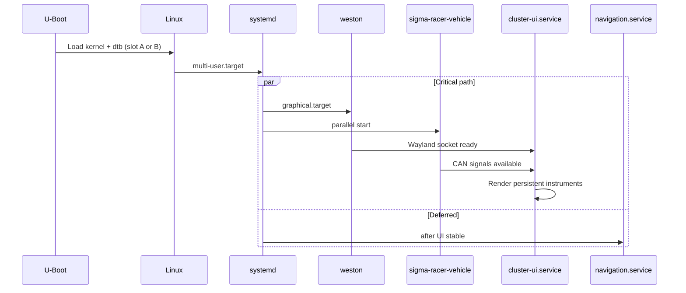

# Sigma Racer Wingman Architecture

## Layer stack

```
┌─────────────────────────────────────────────────────────┐
│  sigma-racer-cluster (Slint UI)          cluster-ui.service      │
│  Persistent: speed / RPM / warnings                     │
│  Windows: nav, connectivity, diag, camera, systems…     │
├─────────────────────────────────────────────────────────┤
│  Weston (Wayland kiosk)         weston.service          │
│  EGL / GBM / Vivante GPU (i.MX)                         │
├─────────────────────────────────────────────────────────┤
│  Subsystem daemons (D-Bus / IPC / shared memory)        │
│  vehicle · navigation · gps · bluetooth · camera        │
│  logger · ota · diagnostics                             │
├─────────────────────────────────────────────────────────┤
│  Linux userspace                                        │
│  systemd · journald · BlueZ · gpsd · SocketCAN          │
│  SQLite · RAUC · GStreamer (camera)                     │
├─────────────────────────────────────────────────────────┤
│  Linux kernel (linux-imx LTS)                           │
│  DRM/KMS · CAN · V4L2 · Wi-Fi/BT                        │
├─────────────────────────────────────────────────────────┤
│  NXP i.MX 8M Plus / i.MX 95                             │
└─────────────────────────────────────────────────────────┘
```

## Boot sequence



Target boot order:

1. `systemd` → mount `/data`, tmpfiles, network link
2. `weston.service` → Wayland compositor
3. `sigma-racer-vehicle` + `gps.service` (parallel, before UI consumes data)
4. `cluster-ui.service` → full-screen Slint app with watchdog
5. Non-critical: `navigation`, `bluetooth`, `camera`, `logger`, `diagnostics`, `ota`

## Storage layout (A/B WIC)

| Partition | Label | Mount | Purpose |
|-----------|-------|-------|---------|
| p1 | boot | vfat `/boot` | Kernel, dtb, RAUC boot slot |
| p2 | rootfs_a | ext4 `/` | Root filesystem slot A |
| p3 | rootfs_b | ext4 `/` | Root filesystem slot B |
| p4 | data | ext4 `/data` | Maps, SQLite, logs, RAUC state |

Production images may enable `read-only-rootfs` with overlay for `/etc` and `/var`.

## IPC model (planned)

| Channel | Use |
|---------|-----|
| Unix socket + JSON/CBOR | Vehicle telemetry stream |
| D-Bus system bus | Bluetooth, diagnostics queries |
| Shared memory (optional) | High-rate CAN mirror to UI |
| SQLite on `/data` | Ride logs, trips, config |

Application layer stays hardware-agnostic; `sigma-racer-vehicle` normalizes SocketCAN frames into typed signals.

## Requirements implementation status

| Section | Status | Layer / recipe |
|---------|--------|----------------|
| Yocto LTS + systemd | Done | `sigma-racer-wingman.conf` |
| i.MX 8M Plus BSP | Done | `sigma-racer-wingman-imx8mp.conf` |
| i.MX 95 BSP | Stub | `sigma-racer-wingman-imx95.conf` |
| Wayland + Weston kiosk | Done | `sigma-racer-wingman-services`, weston bbappend |
| Rust + Slint UI | Done | `sigma-racer-cluster_git.bb` → `sigma-racer-cluster` |
| systemd services | Done | `recipes-sigma-racer-wingman/*-service` |
| SocketCAN | Done | `can-utils`, `sigma-racer-vehicle` |
| BlueZ / Wi-Fi | Done | packagegroup connectivity |
| GPS | Partial | `gpsd`, `gps.service` stub |
| MapLibre / Valhalla | Stub | `recipes-navigation/` |
| RAUC A/B OTA | Partial | `sigma-racer-wingman-ab.wks.in`, `rauc-conf-sigma-racer-wingman` |
| Read-only root | Optional | `DISTRO_FEATURES` |
| Secure boot / TPM | Documented | Board fuse + meta-imx |
| SQLite / `/data` | Done | tmpfiles, fstab bbappend |
| 60 FPS UI | Target | FemtoVG + Vivante GLES |

## Next implementation steps

1. Replace stub daemons with Rust services crate workspace
2. Complete MapLibre Native and Valhalla cross-compile recipes
3. Wire `sigma-racer-vehicle` to SocketCAN DBC / signal schema
4. Add RAUC bundle recipe and delta update pipeline
5. Validate i.MX 95 machine config when BSP is available
6. Enable secure boot CST workflow per NXP documentation
